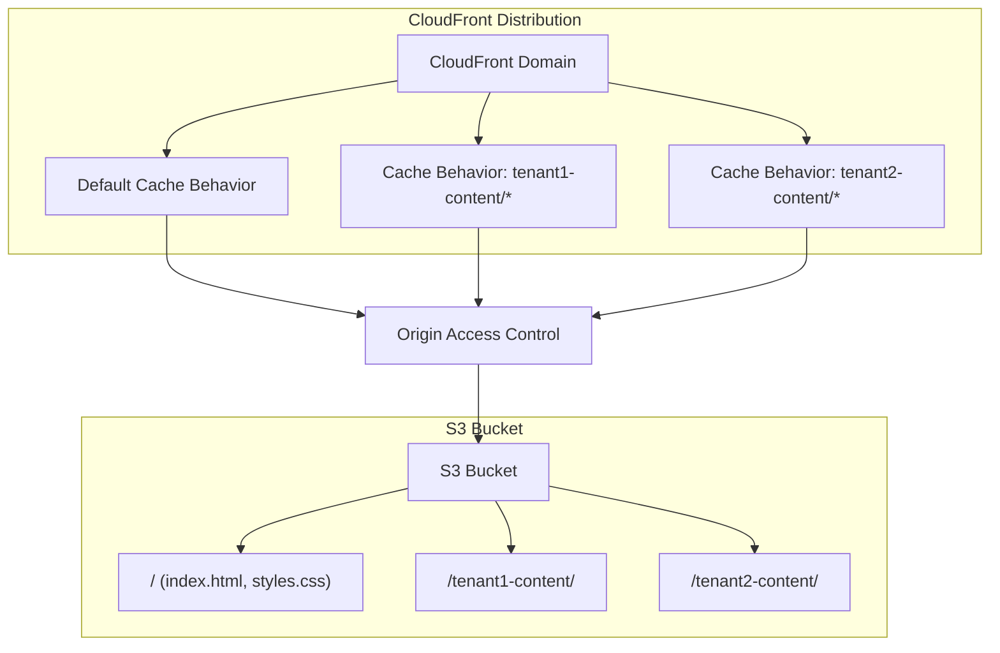

# CloudFront SaaS Multi-Tenant Implementation

## Overview

This script guides you through implementing a CloudFront distribution with path-based routing to simulate multi-tenant functionality. It creates a secure S3-backed CloudFront distribution with path patterns to isolate tenant content, demonstrating the principles of SaaS multi-tenancy without requiring console-specific features.

## Parameters

- **s3_bucket_name** (required): Name for the S3 bucket that will host tenant content
- **region** (required, default: "us-west-2"): AWS region to deploy resources in
- **tenant_names** (required): Comma-separated list of tenant names to create content paths for
- **aws_credentials** (required): AWS credentials with permissions for S3, CloudFront, and IAM

## Steps

### 1. Verify Dependencies

Check for required tools and warn the user if any are missing.

**Constraints:**
- You MUST verify the following tools are available in your context:
  - shell_command
  - read_file
  - write_file
  - fast_edit_file
  - tasklist
  - call_aws
- You MUST ONLY check for tool existence and MUST NOT attempt to run the tools because running tools during verification could cause unintended side effects or consume resources unnecessarily
- You MUST inform the user about any missing tools
- You MUST ask if the user wants to proceed anyway despite missing tools
- You MUST respect the user's decision to proceed or abort

### 2. Configure AWS Credentials

Set up AWS credentials to use with AWS CLI commands.

**Constraints:**
- You MUST ask the user to provide AWS credentials with appropriate permissions for S3 and CloudFront because these services are required for the implementation
- You MUST verify the credentials work by testing with `aws sts get-caller-identity` through the call_aws tool
- You MUST NOT store AWS credentials in permanent files because this poses a security risk by potentially exposing sensitive information
- You MUST use environment variable exports in shell commands to provide credentials because this is a more secure approach for temporary credential use

### 3. Prepare S3 Bucket and Website Files

Create and upload website files for each tenant.

**Constraints:**
- You MUST check if the S3 bucket already exists before attempting to create it because creating an existing bucket would result in errors
- You MUST create the S3 bucket with appropriate settings if it doesn't exist
- You MUST create HTML and CSS content for each tenant with clear tenant identification so users can easily distinguish between tenant content
- You MUST upload files to tenant-specific directories in the S3 bucket (e.g., tenant1-content/, tenant2-content/) to properly isolate tenant data
- You MUST set correct content types when uploading files (text/html, text/css) because incorrect content types can lead to rendering issues

### 4. Create Origin Access Control (OAC)

Create an Origin Access Control to secure the S3 bucket.

**Constraints:**
- You MUST create an Origin Access Control with sigv4 protocol and "always" signing behavior because this provides the most secure access method
- You MUST store the OAC ID for later use in the CloudFront distribution because it's needed for the distribution configuration
- You MUST use the OAC to ensure S3 content can only be accessed through CloudFront because direct bucket access should be prevented for security

### 5. Create CloudFront Distribution with Path-Based Routing

Create a CloudFront distribution with path-based routing for tenant isolation.

**Constraints:**
- You MUST create a distribution configuration JSON file first because complex configurations are better managed through JSON files
- You MUST set the S3 bucket as the origin with the OAC ID
- You MUST configure a default cache behavior for root content
- You MUST add path patterns for each tenant (e.g., "tenant1-content/*") to create proper tenant isolation
- You MUST set appropriate cache settings including compression and HTTPS enforcement because these improve performance and security
- You MUST store the distribution ID and domain name for later use because this information is needed for testing and bucket policies

### 6. Configure S3 Bucket Policy

Update the S3 bucket policy to allow CloudFront access only.

**Constraints:**
- You MUST create a bucket policy JSON file that restricts access to CloudFront only because this prevents direct bucket access
- You MUST include the AWS account ID and CloudFront distribution ARN in the policy because these identify the authorized service principal
- You MUST apply the bucket policy to the S3 bucket
- You MUST ensure the policy prevents direct public access to S3 content because this is a security best practice

### 7. Test the Deployment

Verify the CloudFront distribution is working correctly with the tenant content.

**Constraints:**
- You MUST check the CloudFront distribution deployment status because distributions take time to deploy
- You MUST provide the CloudFront domain URLs for testing each tenant path so users can easily verify the implementation
- You MUST explain that CloudFront deployments take 5-15 minutes to complete to set proper expectations
- You MUST create a test document with instructions for testing the URLs
- You SHOULD create a diagram showing the architecture of the implementation to aid understanding

### 8. Document the Implementation

Create documentation explaining the setup and differences from true multi-tenant distributions.

**Constraints:**
- You MUST create a comprehensive README.md with implementation details to help users understand the solution
- You MUST explain how this path-based approach differs from true CloudFront SaaS multi-tenant distributions so users understand the limitations
- You MUST include the following sections in the README because they provide essential information:
  - Overview
  - Implementation Details
  - How It Works
  - Testing
  - Files
  - Next Steps
- You MUST accurately document what was and was not implemented (e.g., no Connection Group, no ACM Certificate) so users understand what features are missing

## Examples

### Example Test URLs

```
# Default Content
https://d1i5cwx7op5amz.cloudfront.net/index.html

# Tenant 1 Content
https://d1i5cwx7op5amz.cloudfront.net/tenant1-content/index.html

# Tenant 2 Content
https://d1i5cwx7op5amz.cloudfront.net/tenant2-content/index.html
```

### Example Architecture Diagram



### Example CloudFront-vs-Path-Based Comparison

| Feature | Our Path-Based Implementation | True CloudFront SaaS Multi-Tenant |
|---------|------------------------------|----------------------------------|
| Tenant isolation | Via URL paths | Via separate domains |
| Domains | Single CloudFront domain | Multiple tenant domains |
| Connection Group | Not used | Required for routing |
| ACM Certificates | Not used | Required for custom domains |
| Distribution Config | Standard | Multi-tenant specific |
| Tenant Parameters | Not supported | Supported via tenant config |

## Troubleshooting

### AWS Credential Issues
If you encounter "InvalidAccessKeyId" or "InvalidClientTokenId" errors, you should check that your AWS credentials are valid, not expired, and have the necessary permissions for S3 and CloudFront operations.

### CloudFront Not Showing Content
If your CloudFront distribution is deployed but not serving content, you should:
1. Verify the distribution status is "Deployed" not "InProgress"
2. Check the S3 bucket policy allows access from your CloudFront distribution
3. Confirm the path patterns in the cache behaviors match the content paths in S3